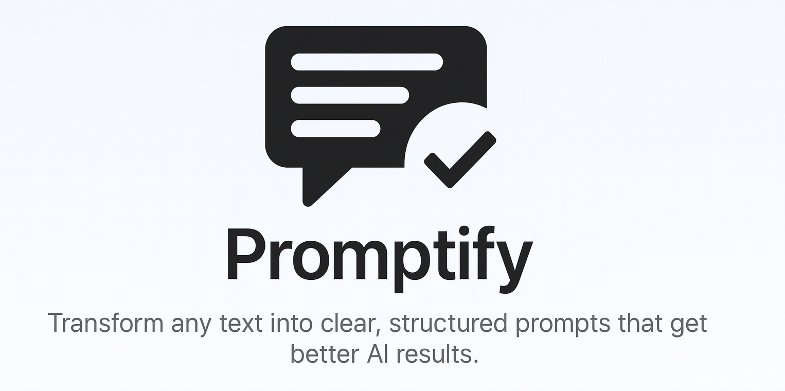

# Promptify - The Grammarly for Prompts 

> Transform any text into clear, structured prompts that get better AI results. One keystroke to enhance your prompts for any AI tool.

## ✨ Features

- **🎯 General Enhancement**: Structure any prompt with clear objectives, context, and success criteria
- **🎨 Image Prompts**: Optimize for Nano Banana, Sora, Midjourney, FLUX, Stable Diffusion with visual elements and technical details
- **💻 Code Prompts**: Technical prompts with stack requirements, constraints, and best practices
- **🔒 Privacy First**: Works 100% locally with Ollama - your data never leaves your machine
- **📚 History & Export**: Save and export enhanced prompts as JSON for reuse
- **⚡ One-Click Workflow**: Copy text → Run command → Get enhanced version → Paste anywhere

## 🚀 Quick Start

New to Promptify? Start here:

👉 **[Complete Setup Guide](docs/01-setup.md)** - Installation, prerequisites, and configuration  
👉 **[5-Minute Quick Start](docs/02-quick-start.md)** - Get running in under 5 minutes  
👉 **[Complete User Guide](docs/03-user-guide.md)** - Master all features with examples  

### TL;DR Setup
1. **Install Ollama**: Download from [ollama.ai](https://ollama.ai/)
2. **Start Ollama**: Run `ollama serve` in terminal
3. **Download a model**: Run `ollama pull llama3.2:3b`
4. **Install Promptify**: Import into Raycast (Developer Mode)
5. **Test it**: Copy text → Run "Enhance Prompt (General)" → See magic ✨

## 📖 How It Works

Promptify transforms rough ideas into structured, effective prompts using three specialized presets:

**📚 [Complete Presets Guide](docs/04-presets-guide.md)** - Deep dive into all preset types with examples

### 🎯 General Enhancement
Perfect for content creation, articles, emails, and general AI interactions.

**[See full examples →](docs/04-presets-guide.md#general-enhancement-preset)**
```
Input: "Write about dogs"

Output:
# 🎯 Objective
Create an informative article about dogs covering characteristics, breeds, and care

# 📋 Context  
Target audience: Pet owners and dog enthusiasts
Tone: Friendly and informative

# 🎨 Format & Style
Article format, 800-1000 words, with clear headings and bullet points

# ✅ Success Criteria
- Covers different dog breeds
- Includes care tips  
- Easy to read and engaging
```

### 🎨 Image Enhancement
Optimized for Midjourney, DALL-E, Stable Diffusion, and all image generation models.

**[See advanced techniques →](docs/04-presets-guide.md#images-enhancement-preset)**
```
Input: "A beautiful sunset"

Output:
**Subject:** Dramatic sunset landscape with silhouetted mountains
**Style:** Photorealistic, cinematic
**Composition:** Wide landscape shot, rule of thirds
**Lighting:** Golden hour, warm backlighting, dramatic sky
**Color:** Vibrant oranges, deep purples, golden yellows
**Details:** Layered mountain silhouettes, scattered clouds
**Camera/Lens:** Wide-angle landscape photography
**Quality Tags:** High resolution, professional photography

**Negative Prompt:** blurry, low quality, oversaturated
```

### 💻 Code Enhancement
Technical prompts for programming, APIs, architecture, and development tasks.

**[See code examples →](docs/04-presets-guide.md#code-enhancement-preset)**
```
Input: "Help me with React"

Output:
# 💻 Technical Objective
Create a reusable React component with proper TypeScript types

# 🛠️ Technology Stack  
- React 18+, TypeScript 4.9+, Modern functional components

# 📝 Requirements
- Properly typed component with prop validation
- Loading and error state handling
- React best practices

# 🎯 Expected Output
- Complete component code
- TypeScript interfaces
- Usage example
- Unit test structure
```

## ⚙️ Configuration

**📚 [Complete Setup Guide](docs/01-setup.md)** - Detailed configuration and troubleshooting

### Quick Settings
Access via Raycast Preferences → Extensions → Promptify:

- **AI Provider**: Ollama (default) 
- **Ollama URL**: `http://localhost:11434` (default)
- **Ollama Model**: `llama3.2:3b` (default)
- **Auto Paste**: Automatically paste after copying (optional)
- **Save to History**: Auto-save enhanced prompts (default: enabled)

## 📋 Commands

**📚 [User Guide](docs/03-user-guide.md)** - Complete feature walkthrough with examples  
**📚 [History Management](docs/05-history-management.md)** - Organize and reuse your prompts

| Command | Description | Shortcut |
|---------|-------------|----------|
| **Enhance Prompt (General)** | Structure any prompt with objectives and context | Set in Raycast |
| **Enhance Prompt — Images** | Optimize for image generation models | Set in Raycast |
| **Enhance Prompt — Code** | Technical prompts for coding assistance | Set in Raycast |
| **History** | Browse, copy, and manage saved prompts | Set in Raycast |

## 💡 Use Cases

### Content Creation
- Transform rough ideas into detailed article briefs
- Create structured prompts for ChatGPT/Claude
- Build consistent content templates

### Visual Design  
- Generate detailed prompts for Midjourney
- Optimize descriptions for FLUX/Stable Diffusion
- Create consistent visual style guides

### Development
- Structure technical requirements for coding AI
- Create clear bug report templates
- Build reusable code prompt libraries

### Team Collaboration
- Standardize prompt formats across team
- Share enhanced prompts via JSON export
- Build prompt libraries for repeated tasks

## 📚 Documentation

### 🚀 Getting Started
- **[Setup Guide](docs/01-setup.md)** - Installation, prerequisites, and configuration
- **[Quick Start](docs/02-quick-start.md)** - Get running in 5 minutes
- **[User Guide](docs/03-user-guide.md)** - Complete feature walkthrough

### 🎯 Advanced Usage  
- **[Presets Guide](docs/04-presets-guide.md)** - Master all three preset types
- **[History Management](docs/05-history-management.md)** - Organize and reuse prompts
- **[Customization](docs/09-customization.md)** - Advanced configuration options

### 🛠️ Development
- **[Architecture](docs/06-architecture.md)** - System design and patterns
- **[Development Guide](docs/07-development.md)** - Contributing and code standards
- **[API Reference](docs/08-api-reference.md)** - Technical documentation

### 🆘 Support
- **[Troubleshooting](docs/10-troubleshooting.md)** - Common issues and solutions
- **[Deployment](docs/11-deployment.md)** - Building and distribution

**📖 [Documentation Hub](docs/00-overview.md)** - Complete documentation index

## 🛠️ Development

**📚 [Development Guide](docs/07-development.md)** - Setup, standards, and contribution guidelines  
**📚 [Architecture Overview](docs/06-architecture.md)** - Technical design and patterns

### Quick Development Setup
```bash
git clone https://github.com/Thomas-Basadonne/promptify-raycast.git
cd promptify-raycast
npm install
npm run dev
```

### Project Structure
```
├── commands/           # Main Raycast commands
│   ├── enhance-prompt-general.tsx
│   ├── enhance-prompt---images.tsx  
│   ├── enhance-prompt---code.tsx
│   └── history.tsx
├── core/              # Business logic
│   ├── types.ts       # TypeScript interfaces
│   ├── presets.ts     # Preset definitions
│   └── storage.ts     # LocalStorage utilities
├── providers/         # AI provider integrations
│   ├── base.ts        # Provider interface
│   ├── ollama.ts      # Ollama implementation
│   └── index.ts       # Provider factory
└── docs/             # Documentation
    ├── 00-overview.md    # Documentation hub
    ├── 01-setup.md       # Installation guide
    ├── 02-quick-start.md # Getting started
    ├── 03-user-guide.md  # Complete features
    ├── 04-presets-guide.md # Preset deep-dive
    ├── 05-history-management.md # History features
    ├── 06-architecture.md # Technical design
    ├── 07-development.md # Contributing guide
    └── 10-troubleshooting.md # Issue solutions
```

### Contributing
1. **Read the [Development Guide](docs/07-development.md)**
2. **Check [Architecture](docs/06-architecture.md)** for design patterns
3. **Submit PR** following our contribution guidelines

## 🔍 Troubleshooting

**📚 [Complete Troubleshooting Guide](docs/10-troubleshooting.md)** - Detailed solutions for all issues

### Quick Fixes

**"AI provider is not available"**
- Ensure Ollama is running: `ollama serve`
- Check model is installed: `ollama list`
- Verify URL in preferences: `http://localhost:11434`

**"No text found in clipboard"**
- Copy some text before running the command
- Check clipboard permissions in System Preferences

**Slow performance**
- Try a smaller/faster model: `ollama pull llama3.2:3b`
- Check available system resources
- Reduce prompt length if very long

**History not saving**
- Check "Save to History" is enabled in preferences
- Verify LocalStorage isn't full
- Try clearing history if corrupted

### Need More Help?
- **[Troubleshooting Guide](docs/10-troubleshooting.md)** - Comprehensive issue solutions
- **[Setup Guide](docs/01-setup.md)** - Installation and configuration help
- **[GitHub Issues](https://github.com/Thomas-Basadonne/promptify-raycast/issues)** - Report bugs or request features
- **[Raycast Discord](https://raycast.com/community)** - Community support

## 🗺️ Roadmap

### v1.1 - Enhanced Experience
- [ ] Custom preset creation and management
- [ ] Improved error messages and recovery
- [ ] Performance optimizations
- [ ] Better loading states

### v1.2 - Extended Functionality  
- [ ] OpenAI/Anthropic provider support
- [ ] Batch prompt processing
- [ ] Preset sharing and import
- [ ] Advanced export formats

### v2.0 - Enterprise Features
- [ ] Team preset libraries
- [ ] Cloud sync for settings
- [ ] Usage analytics
- [ ] API integrations

## 📄 License

MIT License - see [LICENSE](LICENSE) file for details.

## 🙏 Acknowledgments

- [Raycast](https://raycast.com/) for the amazing platform
- [Ollama](https://ollama.ai/) for local AI inference
- The open-source community for inspiration and feedback

## 📖 Documentation Navigation

### 🚀 New Users
**Start here** → [Setup](docs/01-setup.md) → [Quick Start](docs/02-quick-start.md) → [User Guide](docs/03-user-guide.md)

### 🎯 Power Users  
**Advanced usage** → [Presets Guide](docs/04-presets-guide.md) → [History Management](docs/05-history-management.md) → [Customization](docs/09-customization.md)

### 🛠️ Developers
**Technical docs** → [Architecture](docs/06-architecture.md) → [Development Guide](docs/07-development.md) → [API Reference](docs/08-api-reference.md)

### 🆘 Need Help?
**Support** → [Troubleshooting](docs/10-troubleshooting.md) → [GitHub Issues](https://github.com/Thomas-Basadonne/promptify-raycast/issues)

**📚 [Complete Documentation Index](docs/00-overview.md)** - All guides and references

---

**Built with ❤️ for the productivity community**

*Promptify helps you get better AI results by transforming rough ideas into clear, structured prompts. Perfect for ChatGPT, Claude, Midjourney, coding assistants, and any AI tool that needs well-formatted input.*